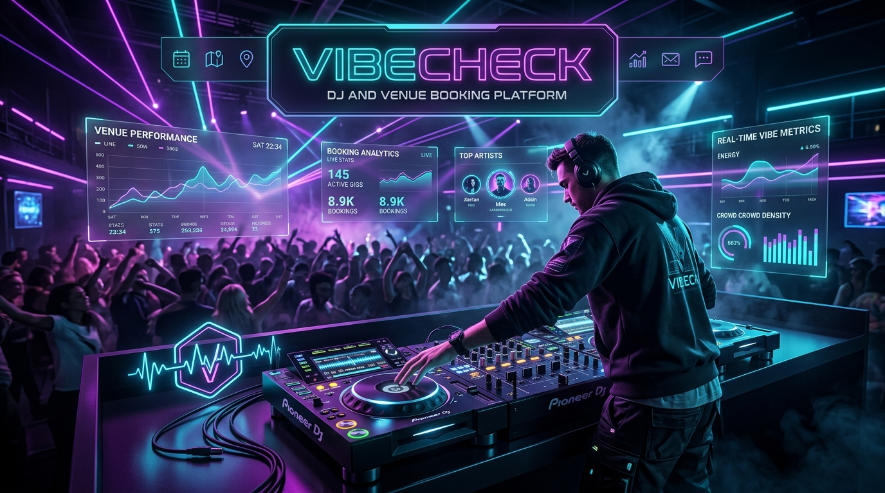
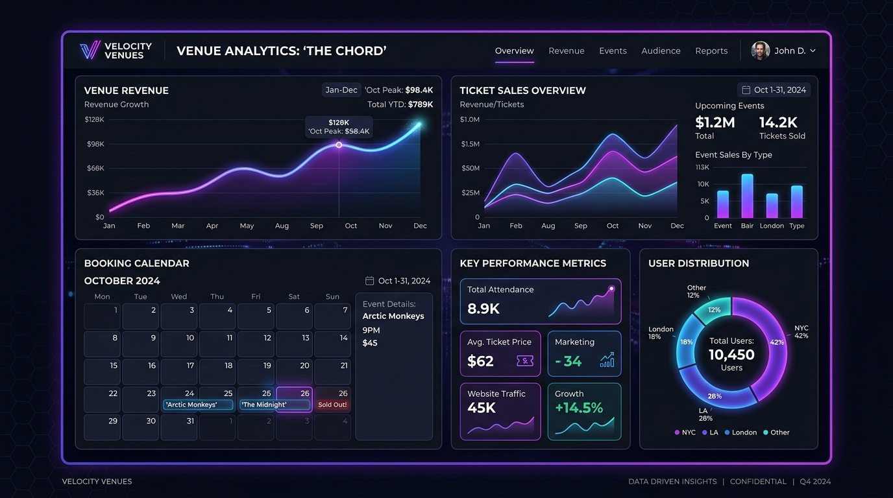
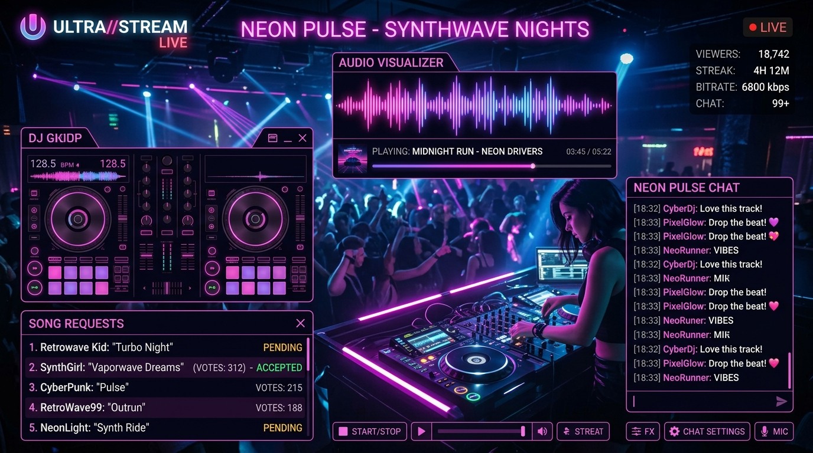
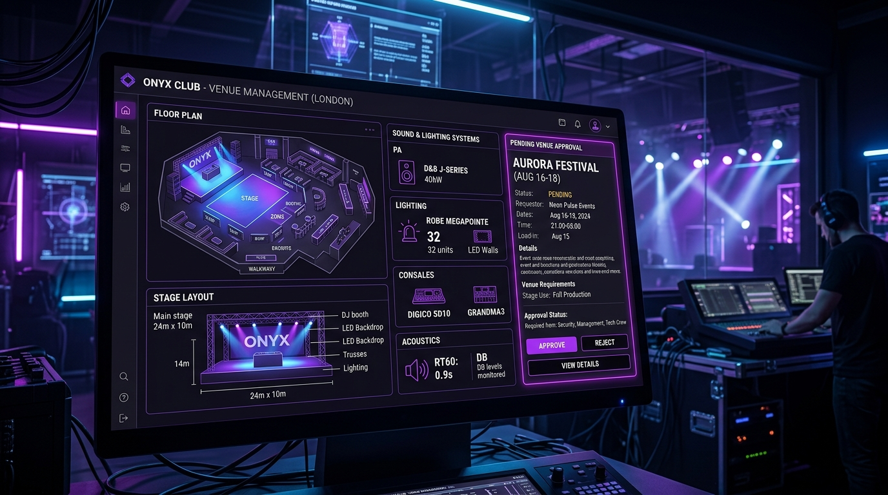
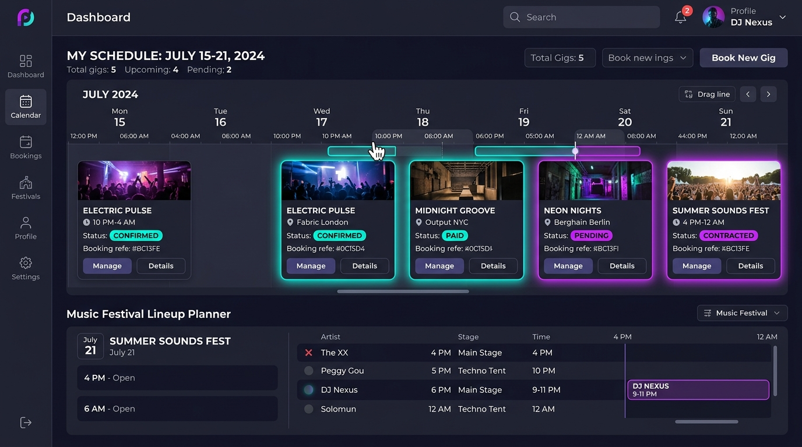

# 🎧 VibeCheck — DJ Booking & Nightlife Venue Management Platform

<p align="center">
  
</p>

<p align="center">
  <strong>The all-in-one live performance management ecosystem connecting elite DJs, nightlife venues, and event organizers.</strong>
</p>

<p align="center">
  <a href="#-key-features"></a>
  <a href="#-tech-stack"></a>
  <a href="#-tech-stack"></a>
  <a href="#-tech-stack"></a>
  <a href="#-tech-stack"></a>
  <a href="#-tech-stack"></a>
</p>

---

## 📌 Executive Summary

**VibeCheck** is a next-generation nightlife and live entertainment platform designed to revolutionize how music venues and DJs collaborate, schedule, and broadcast performances. Built with **React 19**, **TypeScript**, and **Tailwind CSS v4**, the application provides dual interfaces: a **Platform Admin Dashboard** for venue approvals, user administration, and subscription management; and a dedicated **DJ Portal** for real-time live performance broadcasting, gig booking management, audience song requests, and deep analytics.

---

## 📸 Platform Showcase

### 1. DJ Performance Analytics & Revenue Dashboard
Real-time tracking of bookings, monthly gig revenue, fan ratings, genre breakdowns, and venue attendance metrics.
<p align="center">
  
</p>

### 2. Live Broadcast & Audience Interaction Console
DJ live status cockpit featuring audio visualizers, peak audience counters, and an interactive real-time song request queue.
<p align="center">
  
</p>

### 3. Venue Management & Sound System Specifications
Administrative venue inspection module handling pending approvals, stage layouts, sound and lighting configurations, and venue ratings.
<p align="center">
  
</p>

### 4. Interactive Gig Booking & Calendar Scheduling
Complete schedule overview allowing DJs to manage confirmations, upcoming club dates, festival sets, and payment milestones.
<p align="center">
  
</p>

---

## 🚀 Key Features

### 🎛️ 1. DJ Command Center
- **Live Performance Broadcasting**: Broadcast live status with one click (`Go Live Now`), notifying fans and venue attendees.
- **Audience Song Requests**: Receive, review, and accept incoming song requests directly inside the live session interface.
- **Gig Booking Calendar**: Month-by-month interactive scheduling with colored status indicators (Confirmed, Pending, Paid).
- **In-Depth Performance Analytics**:
  - Revenue progression curves & monthly gig volume charts powered by Recharts.
  - Rating trajectories and audience retention statistics.
  - Top genre distribution pie charts (House, Techno, Progressive, Trance).
- **Artist Profile & Social Integrations**: Showcase genres, equipment, booking rates, and link external profiles (Spotify, SoundCloud, Instagram).
- **Availability Management**: Set gig time-slots, blackouts, and recurring availability windows.

### 🏢 2. Super Admin Control Suite
- **Global KPI Overview**: Instant metrics on total revenue, platform users, active DJs, and pending applications.
- **Venue Approval Engine**: Multi-step verification workflow for new club and venue applications.
- **DJ & User Directory**: Searchable, filterable rosters with rating metrics, account statuses, and action menus.
- **Subscription & Tier Management**: Recurring subscription tracking with revenue growth charts and tiered subscriber plans.
- **System Settings**: Configurable platform rules, legal terms, push/email notification alerts, and account security.

### 🛡️ 3. Security & Infrastructure
- **JWT Authentication with Silent Refresh**: Automatic token rotation via Redux Toolkit Query middleware.
- **Protected Routing**: Granular role-based access control guarding sensitive admin and DJ portals.
- **Resilient UI State**: Persistent user sessions leveraging `redux-persist` and secure cookie storage.

---

## 🛠️ Tech Stack & Architecture

| Layer | Technology |
|---|---|
| **Frontend Framework** | [React 19](https://react.dev/) + [Vite 7](https://vitejs.dev/) |
| **Language** | [TypeScript](https://www.typescriptlang.org/) |
| **Styling & Design System** | [Tailwind CSS v4](https://tailwindcss.com/) + [Radix UI](https://www.radix-ui.com/) |
| **State Management** | [Redux Toolkit](https://redux-toolkit.js.org/) + [RTK Query](https://redux-toolkit.js.org/rtk-query/overview) + `redux-persist` |
| **Navigation & Routing** | [React Router DOM v7](https://reactrouter.com/) |
| **Data Visualizations** | [Recharts](https://recharts.org/) |
| **Rich Text Editor** | [TipTap](https://tiptap.dev/) |
| **Icons & Assets** | [Lucide React](https://lucide.dev/) + [React Icons](https://react-icons.github.io/react-icons/) |
| **Form Handling** | [React Hook Form](https://react-hook-form.com/) + [Zod](https://zod.dev/) |
| **Notifications** | [React Toastify](https://fkhadra.github.io/react-toastify/) |

---

## 📂 Project Directory Structure

```plaintext
hussshehata/
├── public/
│   ├── images/                       # Generated platform visuals & screenshots
│   │   ├── vibecheck-hero-banner.jpg
│   │   ├── venue-analytics-dashboard.jpg
│   │   ├── dj-live-broadcasting.jpg
│   │   ├── venue-management-stages.jpg
│   │   └── dj-gig-calendar-schedule.jpg
│   ├── logo.png
│   └── vite.svg
├── src/
│   ├── common/                       # Reusable UI controls (Buttons, Headers, Cards)
│   ├── components/
│   │   ├── admin/                    # Admin views (Home, Settings, Users, Venues)
│   │   ├── dj/                       # DJ specific components (DJ List, Nav)
│   │   ├── shared/                   # Shared navbars, headers, cards
│   │   └── ui/                       # Radix UI primitives (Dialog, Select, Sheet, etc.)
│   ├── layout/                       # DashboardLayout & DjLayout wrappers
│   ├── pages/
│   │   ├── admin/                    # Admin dashboard pages
│   │   ├── dj/                       # DJ portal pages (LiveStatus, Booking, Analytics, Profile)
│   │   ├── Login.tsx
│   │   ├── Register.tsx
│   │   └── ForgotPassword.tsx
│   ├── routes/                       # Route declarations & ProtectedRoute guard
│   ├── store/                        # Redux store, baseApi, and RTK features
│   ├── App.tsx
│   └── main.tsx
├── package.json
└── vite.config.ts
```

---

## ⚡ Quick Start Guide

### Prerequisites
- **Node.js**: v18.0.0 or higher
- **npm** or **pnpm** or **yarn**

### Installation

1. **Clone the repository**:
   ```bash
   git clone https://github.com/Ramjanict/hussshehata.git
   cd hussshehata
   ```

2. **Install dependencies**:
   ```bash
   npm install
   ```

3. **Configure Environment Variables**:
   Create a `.env` file in the root directory:
   ```env
   VITE_API_URL=https://api.yourdomain.com/v1
   ```

4. **Launch development server**:
   ```bash
   npm run dev
   ```
   Open `http://localhost:5173` in your browser.

5. **Build for production**:
   ```bash
   npm run build
   ```

---

## 📄 License & Attribution

Developed and maintained by **Ramjan** ([@Ramjanict](https://github.com/Ramjanict)).  
All rights reserved. Released under the [MIT License](LICENSE).
